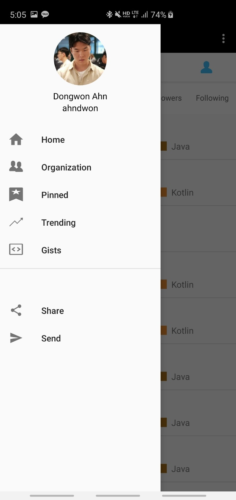
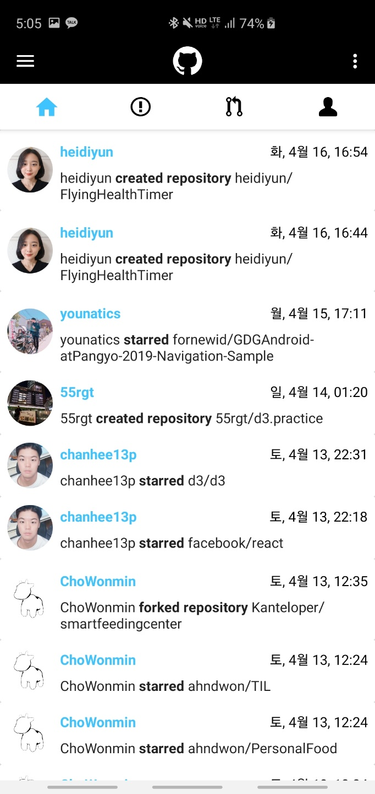
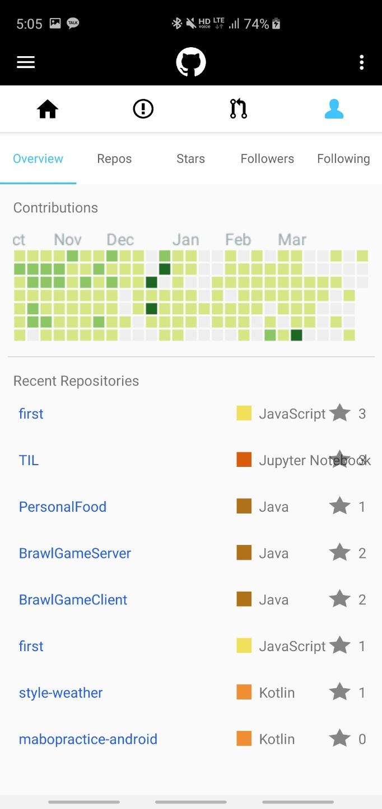
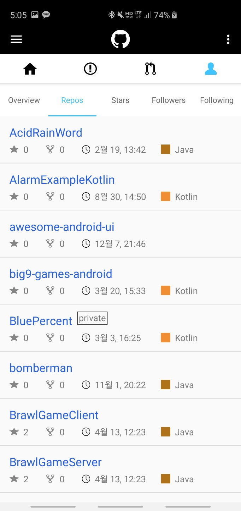

# GetHub
Get your GitHub with GetHub!

Android application for Github.

Used Github API V3

Developed app to study OkHttp3, Retrofit2 and Rest API.

## Sign In
used OAuth

## Sidebar

## Home

## Issue

## Profile

## Repos

